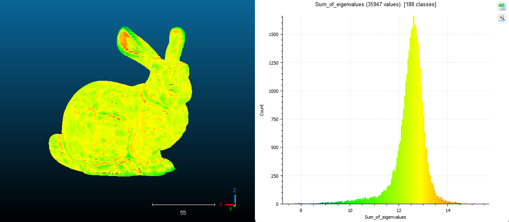

# GeometricFeatures
Compute geometric features of a 3D point cloud from a .LAS file

## Dependencies
```
pip install numpy
pip install scipy
pip install laspy
```

## Covariance matrix

To calculate the geometric features of a point, we need to extract the eigenvalues and eigenvectors of the covariance matrix of the neighborhood of the point ($N$). Where the covariance matrix $\Sigma_N$ is defined as:

$$\Sigma_N = \begin{pmatrix}
 S_{xx} & S_{xy} & S_{xz} \\ 
 S_{yx} & S_{yy} & S_{yz} \\ 
 S_{zx} & S_{zy} & S_{zz}
\end{pmatrix}$$

The vectors $X = (X_{1}, X_{2}, \cdot \cdot \cdot, X_{n})$, $Y = (Y_{1}, Y_{2}, \cdot \cdot \cdot, Y_{n})$ and $Z = (Z_{1}, Z_{2}, \cdot \cdot \cdot, Z_{n})$ contains the $x$, $y$ and $z$ coordinates of each point of the neighborhood $N$ respectively.

Where $S_{xy}$ is the SAMPLE covariance of two vectors $X = (X_{1}, X_{2}, \cdot \cdot \cdot, X_{n})$ and $Y = (Y_{1}, Y_{2}, \cdot \cdot \cdot, Y_{n})$ is:
$$S_{xy} = \frac{1}{n-1}\sum_{i=1}^{n}\left(x_{i} - \bar{x} \right )\left(y_{i} - \bar{y} \right )$$

Where $\bar{x} = \frac{1}{n}\sum_{i=1}^{n}x_{i}$

## Geometric Features

In order to extract the eigenvalues, we need to find the roots of the characteristic polynomial $\left| \Sigma_N - \lambda I \right| = 0$. As we are dealing with 3D point clouds we must find three eigenvalues $\lambda_{1}$, $\lambda_{2}$ and $\lambda_{3}$.

Thus, the following geometric features are defined:

```math
\text{Sum of eigenvalues}: \sum_{i} \lambda_{i}
```
```math
\text{Omnivariance:} \left( \prod_{i} \lambda_{i} \right)^\frac{1}{3}
```
```math
\text{Eigenentropy:} -\sum_{i}\lambda_{i}\ln\left( \lambda_{i} \right )
```
```math
\text{Anisotropy:} \frac{\lambda_{1} - \lambda_{3}}{\lambda_{1}}
```
```math
\text{Linearity:} \frac{\lambda_{1} - \lambda_{2}}{\lambda_{1}}
```
```math
\text{Planarity:} \frac{\lambda_{2} - \lambda_{3}}{\lambda_{1}}
```
```math
\text{Sphericity:} \frac{\lambda_{3}}{\lambda_{1}}
```
```math
\text{PCA1:} \lambda_{1}\left ( \sum _{i} \lambda_{i} \right )^{-1}
```
```math
\text{PCA2:} \lambda_{2}\left ( \sum _{i} \lambda_{i} \right )^{-1}
```
```math
\text{Surface variation:} \lambda_{3}\left ( \sum _{i} \lambda_{i} \right )^{-1}
```
```math
\text{Verticality:} 1 - \left | n_{z} \right |
```

## Visualization

**Omnivariance**


**Sum of eigenvalues**



**Eigenentropy**

